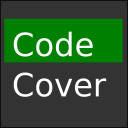
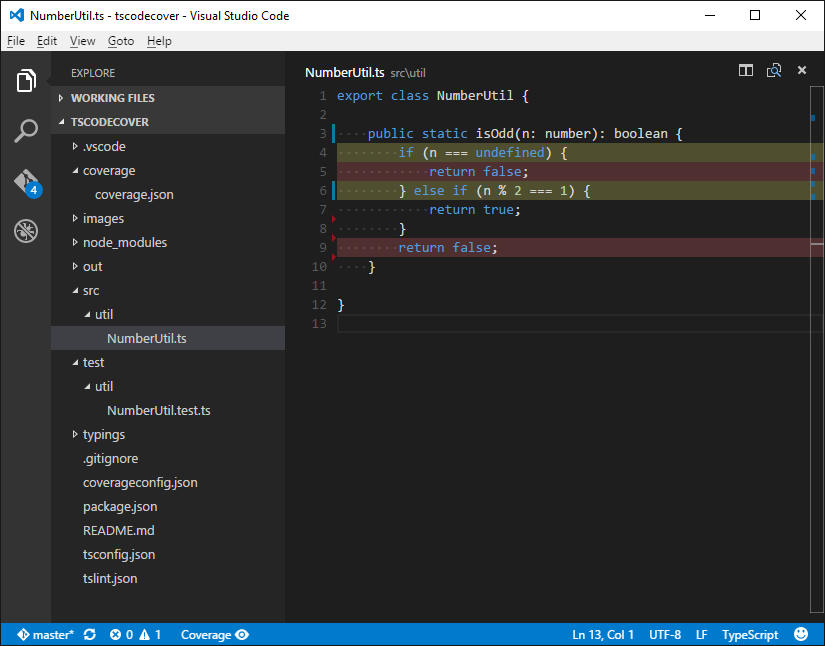

# TypeScript のコード カバレッジを Visual Studio Code で可視化する

　TypeScript のプロジェクトで，単体テスト コードが実行された／実行されていないコードを
ソース コード エディター上に色分け表示（カバレッジ ハイライト）できれば，単体テストの消化効率をもっと上げられるのに，と思うことがあります。

　本稿では，TypeScript のエディターに Visual Studio Code (VS Code) を使い，コード カバレッジを VS Code 上で可視化する方法を解説します。


## Code Cover

　VS Code でコード ハイライトするには，[Bradley Meck](https://github.com/bmeck) 氏 (Node.js コミッター) 制作
の "[Code Cover](https://github.com/bmeck/vscode-code-cover)" を使用します。

[](https://marketplace.visualstudio.com/items?itemName=bradleymeck.codecover)

　Code Cover はシンプルな設定ファイル (coverageconfig.json) ひとつで動作する素晴らしい VS Code Extension ですが，
日本語での紹介記事はもちろん，英語での紹介記事も見つからないのが現状です。
本稿をきっかけに少しでも多くの開発者に知って（使って）いただければ幸いです。


### クイック スタート

　TypeScript のカバレッジ ハイライトをサポートしたサンプルを GitHub のリポジトリに作成しました。Code Cover の動作確認にご利用ください。

　Github, "tscodecover", https://github.com/k--kato/tscodecover.git

```bash
git clone https://github.com/k--kato/tscodecover.git
cd tscodecover
npm install
npm run build
code .
```
　下記 [Code Cover のインストール](#code-cover-のインストール) で Code Cover をインストールします。src/util/NumberUtil.ts を開くとカバレッジ ハイライトされています。


### Code Cover のインストール

1. VS Code のコマンド パレット を開きます Cmd-Shift-P (OSX) or Ctrl-Shift-P (Windows, Linux)
1. `Extensions: Install Extension` を入力＆選択します
1. `ext install codecover` を入力します （☁ マークを押下してインストールします）
1. VS Code を再起動します（インストール完了メッセージが表示された後に，再起動を促すメッセージが表示されます）


### TypeScript x Code Cover の構成例

```bash
tscodecover/
├── coverageconfig.json
├── package.json
├── tsconfig.json
├── tslint.json
|
├── .vscode/
|   └── tasks.json
├── coverage/
|   ├── coverage.json
|   └── lcov.info
├── src/
│   └── Util/
│       └── NumberUtil.ts
├── test/
│   └── Util/
│       └── NumberUtil.test.ts
├── out/
└── typings/
    ├── node.d.ts
    └── vscode-typings.d.ts
```

| ファイル                                                                      | 役割                       | 説明             |
|:----------------------------------------------------------------------------|:---------------------------|:----------------|
| [coverageconfig.json](https://github.com/bmeck/vscode-code-cover)           | Code Cover 設定ファイル      | coverage.json または lcov.info を指定します |
| [package.json](https://docs.npmjs.com/files/package.json)                   | npm パッケージ管理ファイル     | プロジェクトに必要なパッケージの依存関係やビルド スクリプトなどを設定します |
| [tsconfig.json](https://github.com/Microsoft/TypeScript/wiki/tsconfig.json) | TypeScript 設定ファイル      | トランスパイルする ES のバージョンや Sourcemap の出力を設定します |
| [tslint.json](http://palantir.github.io/tslint/rules/)                      | TSLint 設定ファイル          | TypeScript の文法を検証するルールを記載します |
| [tasks.json](https://code.visualstudio.com/Docs/editor/tasks)               | VS Code タスク設定ファイル    | VS Code のコマンド パレットから build や test 等のコマンドを使えるように登録します |
| coverage.json                                                               | カバレッジ結果               | Code Cover が参照します |
| lcov.info                                                                   | カバレッジ結果               | Code Cover が参照します |
| [src](https://github.com/Microsoft/TypeScript/blob/master/doc/spec.md)      | ソース コード                | ソース コード TypeScript で記述します |
| [test](http://mochajs.org/)                                                 | 単体テスト コード             | テスト コードを TypeScript (mocha) で記述します |
| out                                                                         | 実行コード                   | TypeScript が Javascript にトランスパイル＆出力されます |


### Code Cover の設定

coverageconfig.json
```json
{
    "coverage": ["./coverage/coverage.json"],
    "sourcemapped": ["./out/src/*/**.js"],
    "automaticallyShow": true,
    "ignore": ["*.json"]
}
```

| 設定項目             | 説明                                         |
|:--------------------|:--------------------------------------------|
| coverage            | coverage.json または lcov.info を指定します    |
| sourcemapped        | TypeScript の Sourcemap が出力されるフォルダを指定します |
| automaticallyShow   | true: 自動でカバレッジをハイライトします <br>false: カバレッジをハイライトするには，ステータス バー `Coverage` をクリックするか，コマンド パレットから `Highlight code coverage` を実行する必要があります |
| ignore              | ハイライトしないファイルを指定します            |


### Code Cover に必要なパッケージ

　Code Cover はコード カバレッジの情報 (coverage.json または lcov.info) を解析して VS Code 上にカバレッジ ハイライトするため，
テスト コードのフレームワークと，カバレッジ出力をサポートするパッケージがそれぞれ必要となります。

| パッケージ                                           | 説明                                                   |
|:---------------------------------------------------|:-------------------------------------------------------|
| [mocha](https://github.com/mochajs/mocha)          | Javascript のテスト フレームワーク                         |
| [istanbul](https://github.com/gotwarlost/istanbul) | カバレッジ情報を含む coverage.json や lcov.info を出力します |

 （※ coverage.json や lcov.info が出力されるのであれば，どの Javascript テスト フレームワークでも問題ありません）

　パッケージの依存関係を継続的に管理するために，インストールするパッケージは package.json に記述します。一度書けば，~~３０億のデバイスで~~どこでも実行できます。

package.json
```json
{
    "dependencies": {
    },
    "devDependencies": {
        "typescript": "^1.7.5",
        "vscode": "^0.10.7",
        "tslint": "^3.3.0",
        "mocha": "^2.4.5",
        "istanbul": "^0.4.2"
    }
}
```

　パッケージのインストールは２つのワードで完了します。

```bash
npm install
```


### TypeScript x mocha でテスト コードをはじめる

　mocha のテスト コードには大きく[５種類](https://mochajs.org/#interfaces)の記述スタイル（インターフェイス）があります。今回は代表的な２種類を紹介します。


| 記述スタイル（インターフェイス）                                     | メソッド                                       |
|:---------------------------------------------------------------|:--------------------------------------------|
| [TDD](https://mochajs.org/#tdd) (Test-Driven Development)      | assert, describe(), context(), it(), before(), after(), beforeEach(), afterEach()  |
| [BDD](https://mochajs.org/#bdd) (Behavior-Driven Development)  | should, suite(), test(), suiteSetup(), suiteTeardown(), setup(), teardown() |


* TDD とは

>TDDは書いたコードをそのコードを使う側からの視点で考えるプログラミング手法です。この手法によって新たな設計が生まれます。
>テストを書くことは、テスト対象のコードがどのように使われるのかを記述することで、そのテストに通るように対象のコードを書きます。
>この手法はプログラマの専売特許で適切に使えばたくさんの利点があります。テストを書くことでドメインへの理解が深まり、命名がしやすくなります。
>テストすることで理解のギャップが明確になりますし、自動化されたテストが一式あれば退行的な欠陥を見つけられます。 - Dan North

* BDD とは

>BDDは開発の方法論です。プログラミング手法のTDDよりは、XPのような方法論に近いです。互いに視点の違う利害関係者を同じ土俵に乗せ、
>同じものを評価し、同じ期待値を持つようにするための方法論です。利害関係者の価値観の相違に起因する問題がなければ、BDDを使う必要はないかもしれません。 - Dan North

　Java の JUnit や C# の xUnit は（標準では）TDD スタイルのため，TDD 経験者は多いと思います。今回は（開発視点で） TDD スタイルを使用します。

#### ソース コード

src/util/NumberUtil.ts
```typescript
export class NumberUtil {

    public static isOdd(n: number): boolean {
        if (n === undefined) {
            return false;
        } else if (n % 2 === 1) {
            return true;
        }
        return false;
    }

}

```

#### テスト コード (TDD)

test/util/NumberUtil.test.ts (TDD)
```typescript
import * as assert from 'assert';
import {NumberUtil} from '../../src/util/NumberUtil';

suite('NumberUtil Tests', () => {

    test('isOdd', () => {
        // arrange
        const n = 2501;

        // act
        const actual: boolean = NumberUtil.isOdd(n);

        // assert
        assert.equal(actual, true);
    });

});

```

　Arrange （テスト データの準備），Act（テスト対象の実行），Assert（検証） は [AAA パターン](https://msdn.microsoft.com/ja-jp/library/hh694602.aspx)と呼ばれ，単体テストを記述する一般的な方法です。


### mocha x istanbul でカバレッジ出力

　mocha と istanbul で coverage.json を出力します。

```bash
./node_modules/.bin/istanbul cover ./node_modules/mocha/bin/_mocha --report none -- --ui tdd ./out/test/**/*.js
```

| 引数                                                                           | 説明                                         |
|:-------------------------------------------------------------------------------|:--------------------------------------------|
| [istanbul](https://github.com/gotwarlost/istanbul)                             | coverage.json または lcov.info を指定します    |
| [cover](https://github.com/gotwarlost/istanbul#the-cover-command)              | TypeScript の Sourcemap が出力されるフォルダを指定します |
| [_mocha](https://github.com/gotwarlost/istanbul/issues/44)                     | true: 自動でカバレッジをハイライトします <br>false: カバレッジをハイライトするには，ステータス バー `Coverage` をクリックするか，コマンド パレットから `Highlight code coverage` を実行する必要があります |
| [--report none](https://github.com/gotwarlost/istanbul#multiple-process-usage) | istanbul はソース コードをカバレッジ ハイライトした html レポートを出力しますが，今回は coverage.json のみ必要なため，html レポート出力を `none` に設定します |
| [-- --ui tdd](https://mochajs.org/#interfaces)                                 | はじめの `--` は 以降のパラメーターを `_mocha` に設定することを意味します <br>`--ui tdd` は TDD スタイルのテスト コードであることを意味します |
| ./out/test/**/*.js                                                             | 実行するテスト コード を指定します    |


### package.json に依存関係とスクリプトをまとめる

　カバレッジを出力するだけのために，istanbul の長大なコマンドを毎回思い出す必要はありません。
package.json の `scripts` 項目にカバレッジを出力するコマンドを定義すれば，３ワードでカバレッジを取得できます。

package.json
```json
{
    "dependencies": {
    },
    "devDependencies": {
        "typescript": "^1.7.5",
        "vscode": "^0.10.7",
        "tslint": "^3.3.0",
        "mocha": "^2.4.5",
        "istanbul": "^0.4.2"
    },
    "scripts": {
        "clean": "rm -rf out",
        "compile": "node ./node_modules/vscode/bin/compile -p ./",
        "watch": "node ./node_modules/vscode/bin/compile -watch -p ./",
        "coverage": "./node_modules/.bin/istanbul cover ./node_modules/mocha/bin/_mocha --report none ./out/test/**/*.js",

        "prebuild": "npm run clean",
        "build": "npm run compile",
        "postbuild": "npm run coverage"
    }
}
```

　`build` を実行するコマンドです。 

```bash
npm run build
```

　`build` を実行すると，`prebuild`，`build`，`postbuild` の順にコマンドが実行されます。


### tasks.json で package.json のスクリプトを実行する

　ターミナル（コマンド プロンプト）で毎回 `npm run` コマンドを実行するのは面倒です。

　`.vscode/tasks.json` にタスクを定義すると，VS Code のコマンド パレットに `build` (Cmd-Shift-B (OSX) or Ctrl-Shift-B (Windows, Linux)) や `test` (Cmd-Shift-T (OSX) or Ctrl-Shift-T (Windows, Linux)) と
入力するだけで，package.json の `scripts` に定義したスクリプトを VS Code 上で実行できます。素晴しいです。


.vscode/tasks.json
```json
{
    "version": "0.1.0",
    "command": "npm",
    "isShellCommand": true,
    "showOutput": "always",
    "args": ["run"],
    "tasks": [
        {
            "taskName": "clean",
            "suppressTaskName": false,
            "args": [],
            "problemMatcher": "$tsc"
        },
        {
            "taskName": "build",
            "suppressTaskName": false,
            "args": [],
            "problemMatcher": "$tsc"
        },
        {
            "taskName": "test",
            "suppressTaskName": true,
            "args": ["coverage"]
        },
        {
            "taskName": "watch",
            "suppressTaskName": true,
            "args": ["watch", "--loglevel", "silent"],
            "isWatching": true,
            "problemMatcher": "$tsc-watch"
        }
    ]
}
```


### カバレッジ ハイライトの結果を確認する

　TypeScript が VS Code 上でカバレッジ ハイライトできました。（もちろんトランスパイルされる前の TypeScript がハイライトされる）



| 色                                                                                | 説明                           |
|:----------------------------------------------------------------------------------|:-------------------------------|
| 赤 <span style="background-color:rgba(128,64,64,0.5)">return false;</span>           | 未実行コード (Line not covered)  |
| 黄 <span style="background-color:rgba(128,128,64,0.5)">if (n === undefined) {</span> | 未実行分岐 (Branch not covered) |
| 無 return true;                                                                      | 実行済コード (Covered)           |

　Code Cover の悪い点は，実行済コードがハイライトされないないことです。(TODO: 実行済みのコードがハイライトされるように Pull Request する）


# まとめ

* VS Code のカバレッジ ハイライトには Extension の Code Cover が必要であることがわかった
* VS Code に Extension の Code Cover がインストールできた
* Code Cover には coverage.json または lcov.info が必要であることがわかった
* mocha と istanbul を package.json でインストールできた
* mocha で TDD のテスト コードを書くことができた
* mocha と istanbul で coverage.json が取得できた
* VS Code にタスクを登録して，VS Code 上のコマンドだけでカバレッジが取得できるようになった
* TypeScript と VS Code でカバレッジ ハイライトができた


# 付録

## カバレッジがエビデンスのプロジェクト

　弊社の検収条件には，「単体テスト コードのコード カバレッジ 100% を満たすこと」と記載しておりますが，御社の納品物に単体テスト コードとカバレッジの成果物が含まれていないようです。

　御社では TypeScript のプロジェクトで「コード カバレッジ」を計測していますでしょうか？

　速やかにご提出ください。


## Wikipedia vs. マーティン・ファウラー vs. ゴイコ・アジッチ

　何のためのカバレッジ？

### Wikipedia

>コード網羅率（コードもうらりつ、英: Code coverage ）コードカバレッジは、ソフトウェアテストで用いられる尺度の1つである。プログラムのソースコードがテストされた割合を意味する。（中略）

>インフラなどの重要なアプリケーションでは、何らかの形でコード網羅率 100% のテストを実施したことを示すよう要求されることが多い。（中略）

>このようなテスト作成の最終的な目的は、コードの修正時のバグ作りこみを防ぐ回帰テストの作成にある。 - Wikipedia


### マーティン・ファウラー

>「テストカバレッジ(コードカバレッジ)の目標値はどれくらいがいいのか？」という質問とか、コードカバレッジの高さの自慢とかを、ときどき耳にする。でも、大事なポイントを外している。コードカバレッジは、コードのテストされていない部分を発見するための有用なツールである。ただテスト自体がどれだけ良いかという指標としては、テストカバレッジはほとんど役に立たない。（中略）

>思慮深くテストを実施すれば、テストカバレッジはおそらく80%台後半か90%台になるだろう。100%は信用ならない。カバレッジの数字ばっかり気にして、自分が何をやっているかわかっていない人間のいる臭いがする。- マーティン・ファウラー


### ゴイコ・アジッチ

>網羅率を目標にするのは馬鹿げています。最もリスクが大きいコードを10%網羅することは、リスクのないコードを99%網羅することよりも遥かに優れています。テストの網羅率よりもリスクの網羅率のほうが優れた指標だと思います。私はAttribute Component Capability Matrixを使ってリスクを評価し何をどのように網羅するかを決めています(James WhittakerのHow Google Tests Softwareを参照ください)。 - ゴイコ・アジッチ


## コード カバレッジが高いと品質が高いのか？

　コード カバレッジが 100% のプロジェクトの品質が高いのでしょうか？

　No です。

>カバレジが多くなったときに欠陥が減る結果になることを示すエビデンスはほとんどないのが実情です - ナチーアパン・ナガパン，トーマス・ボール 「エビデンスに基づくエラー予測」


## コード カバレッジの問題点

>カバレジは実行される命令の割合だけであり，命令の間違いを含んでいるかを考慮しない

>テスト実施者のデータで命令や分岐が実行されても，顧客や利用時のシナリオとデータが異なる

>Windows Vista ４千万行で計測したところ，コードカバレジと品質との間には弱い正の相関があり，精度 83.3%，再現率 54.8% 低い値であった


## コード カバレッジは何のための指標か？

　Microsoft の ナチーアパン・ナガパン，トーマス・ボールは論文「エビデンスに基づくエラー予測」で提案しています。
　
　**コードの変更量が多いコードや複雑度が高いコードのカバレッジを高めに設定する**

　カバレッジ 100% のプロジェクト

## VS Code Extension とは

　VS Code は "Extension"（機能拡張）がサポートされています。Go 言語，Python，Unity，PHP や Cordova（Android や iOS のデバイス上で）のデバッグ機能，
eslint，tslint や hlint などの lint 機能，もちろん Vim スタイルのサポートも追加が可能となっています。「**VS Code は環境**」です。
VS Code 拡張機能の一覧は [Visual Studio Marketplace (Preview)](https://marketplace.visualstudio.com/#VSCode) で確認できます。


## Code Cover 以外の VS Code カバレッジ可視化ツール

　VS Code にも有償のテスト ツールがあり，[Artem Govorov](http://dm.gl/) 氏が制作した ["Wallaby.js for Visual Studio Code"](https://marketplace.visualstudio.com/items?itemName=WallabyJs.wallaby-vscode) は，
コードの修正で即時にテストの実行結果や実行／未実行を VS Code 上に色分け表示する機能があり，Code Cover より高機能です。


# 参考ノート

1. Wikipedia, 「コード網羅率」, https://ja.wikipedia.org/wiki/%E3%82%B3%E3%83%BC%E3%83%89%E7%B6%B2%E7%BE%85%E7%8E%87
1. Martin Fowler's Bliki (ja), 「テストカバレッジ」, http://bliki-ja.github.io/TestCoverage/
1. InfoQ, 「バーチャルパネル: コードとテストの比率、TDD、BDD」, http://www.infoq.com/jp/articles/virtual-panel-tdd-bdd
1. Monaca X Onsen Blog, "Mocha + Chai.js unit testing for ES6 with Istanbul code coverage", https://onsen.io/blog/mocha-chaijs-unit-test-coverage-es6/
1. ＠IT Insider.NET, 「Visual Studio Codeでエクステンション機能を使ってみよう」, http://www.atmarkit.co.jp/ait/articles/1511/27/news029.html
1. O'Reilly Japan, 『Making Software――エビデンスが変えるソフトウェア開発』, https://www.oreilly.co.jp/books/9784873115115/
1. Qiita, 「[意訳]私がGulpとGruntを手放した理由」, http://qiita.com/chuck0523/items/dafdbd19c12efd40e2de
